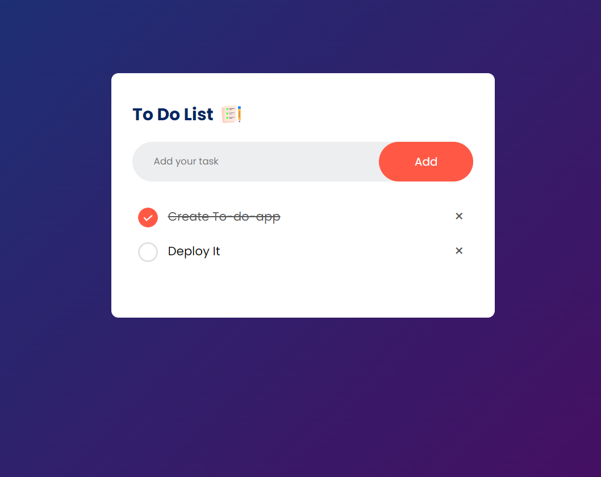

# To-Do-List

A straightforward to-do list web application built with HTML, CSS, and JavaScript. This project is designed to help users keep track of their tasks and manage their daily activities.

## Features

- Add new tasks to the to-do list.
- Mark tasks as complete.
- Remove tasks from the list.
- Responsive design for various screen sizes.

## Screenshots

## Technologies Used

- HTML
- CSS
- JavaScript